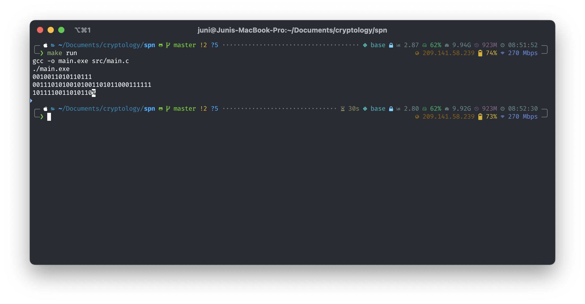
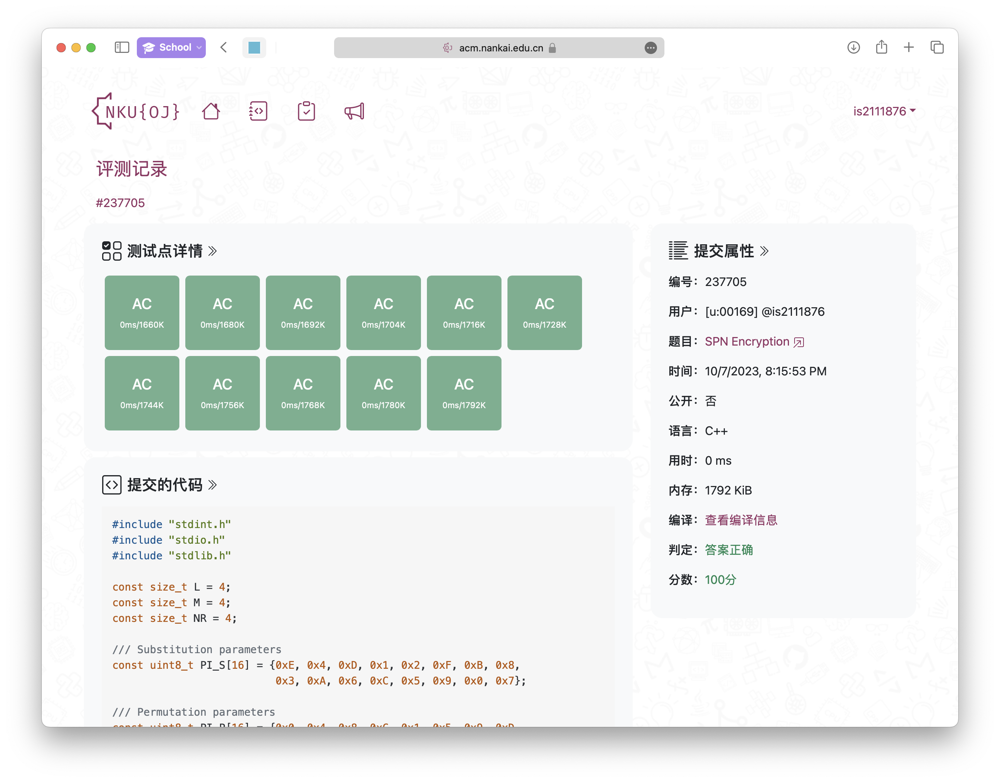
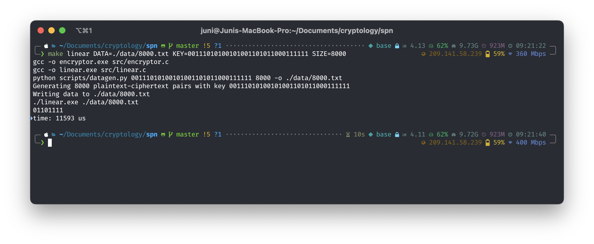
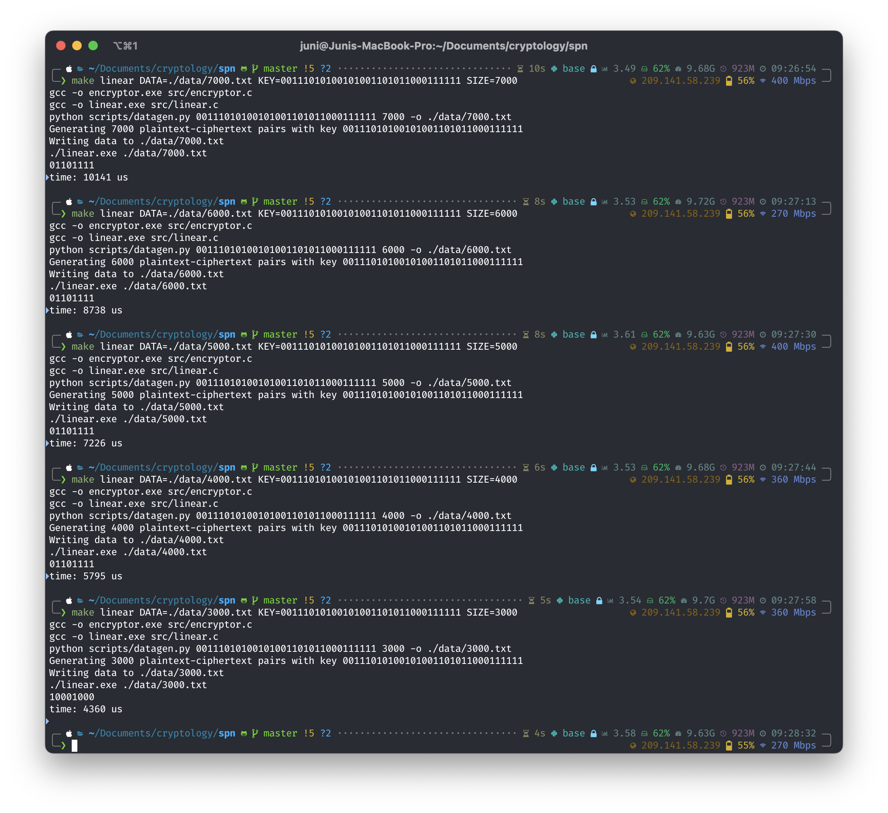
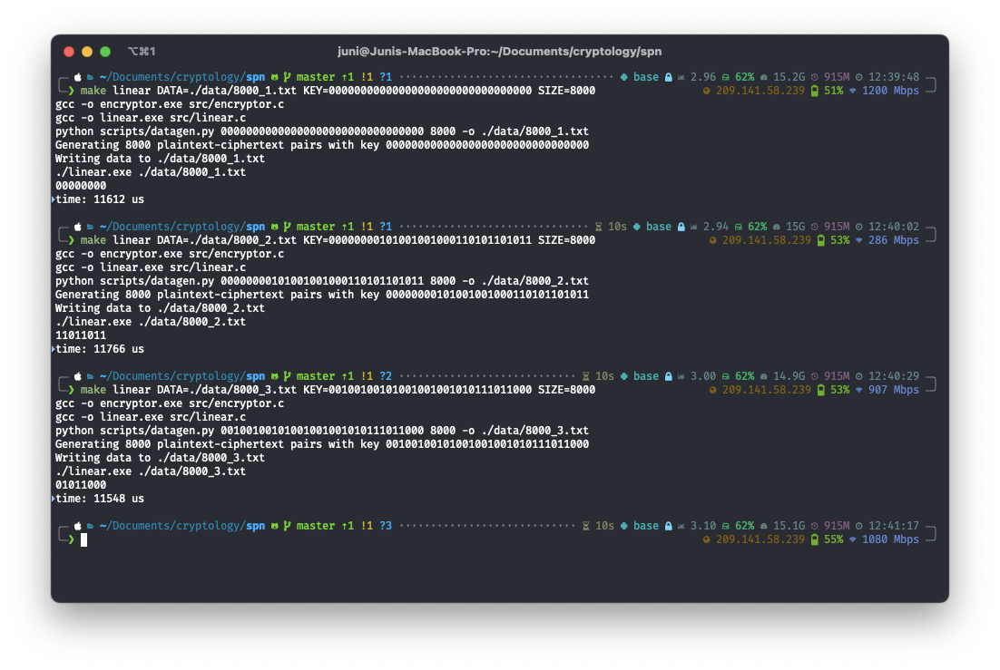
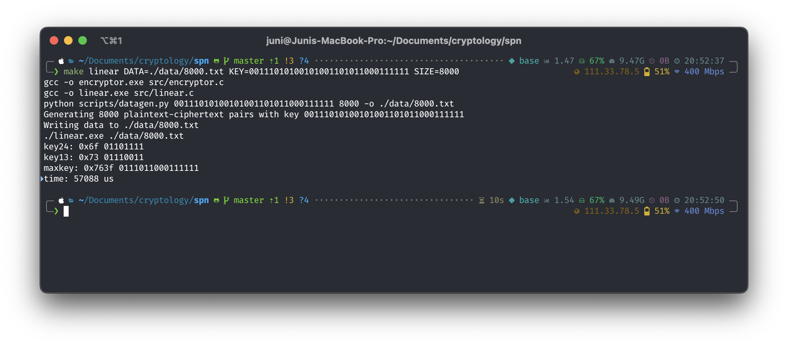
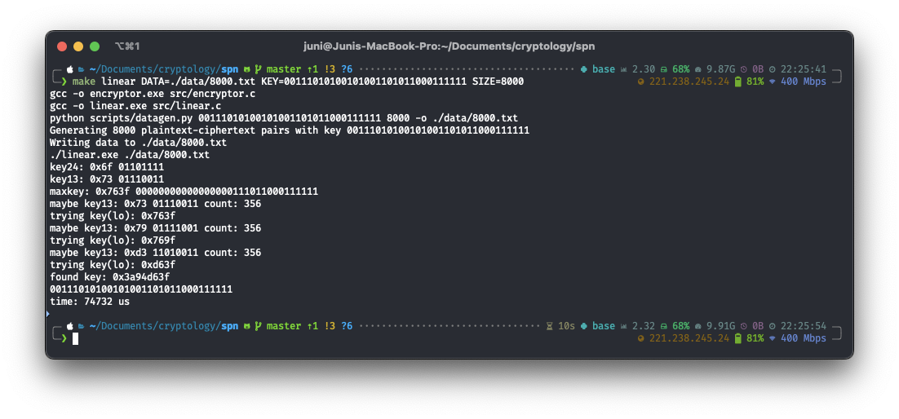
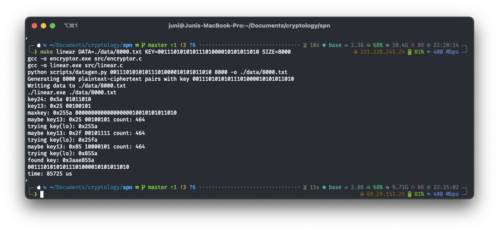
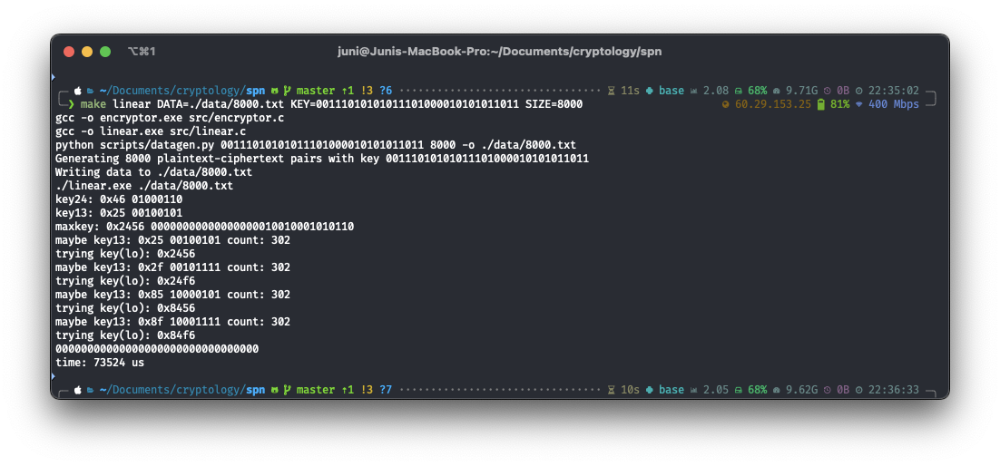

# 密码学实验报告

SPN 网络的实现以及对线性密码分析方法的探索。

## SPN 加密算法

### 实现

SPN 的实现位于 `src/` 目录下，其中 `main.c` 用于 OJ 提交，`encryptor.c` 为一个命令行 SPN 加密器，用于线性分析中生成数据。

代码首先定义了实现的 SPN 算法的参数

```c
const size_t L = 4;
const size_t M = 4;
const size_t NR = 4;

/// Substitution parameters
const uint8_t PI_S[16] = {0xE, 0x4, 0xD, 0x1, 0x2, 0xF, 0xB, 0x8,
                          0x3, 0xA, 0x6, 0xC, 0x5, 0x9, 0x0, 0x7};

/// Permutation parameters
const uint8_t PI_P[16] = {0x0, 0x4, 0x8, 0xC, 0x1, 0x5, 0x9, 0xD,
                          0x2, 0x6, 0xA, 0xE, 0x3, 0x7, 0xB, 0xF};
```

然后定义了一个对一个 16 位整数进行分组的结构体。此处也可以使用位运算，但是为了清晰起见，使用了结构体和指针运算结合。

```c
/// Memory layout of a grouped `u`.
typedef struct {
  uint16_t a : 4;
  uint16_t b : 4;
  uint16_t c : 4;
  uint16_t d : 4;
} Group;
```

之后，利用这个结构体的内存布局实现 S 盒的计算

```c
/// Group-wise substitution
uint16_t substitute(uint16_t u) {
  uint16_t v = 0;
  Group* g = (Group*)(&u);
  Group* h = (Group*)(&v);

  h->a = PI_S[g->a];
  h->b = PI_S[g->b];
  h->c = PI_S[g->c];
  h->d = PI_S[g->d];

  return v;
}
```

以及密钥生成的函数，此处需要注意整数中比特的顺序与密钥定义中 $k_1, k_2,\cdots, k_{32}$ 的顺序相反，因此需要进行一次左移和右移。

```c
static uint32_t key = 0;

/// Generate a key for the `r`-th round
uint16_t generate_key(size_t r) {
  return (key << (4 * r - 4)) >> 16;
}
```

最后实现 P 盒，同样注意比特顺序在整数中的问题。

```c
/// Bitwise permutation
///
/// The highest bit in the number is the first bit in the array.
/// The `PI_P` should be applied in reverse order.
uint16_t permute(uint16_t v) {
  uint16_t w = 0;

  for (size_t i = 0; i < 16; i++) {
    uint16_t bit = (v & (0x8000 >> i)) != 0;
    w |= bit << (15 - PI_P[i]);
  }

  return w;
}
```

最后，实现完整的 SPN 加密算法。

```c
/// Encryption
uint16_t encrypt(uint16_t plaintext) {
  uint16_t w = plaintext;
  uint16_t u, v, key;

  for (size_t r = 1; r <= NR - 1; r++) {
    key = generate_key(r);
    u = w ^ key;
    v = substitute(u);
    w = permute(v);
  }

  key = generate_key(NR);
  u = w ^ key;
  v = substitute(u);

  key = generate_key(NR + 1);

  uint16_t ciphertext = v ^ key;

  return ciphertext;
}
```

以上就是 SPN 实现中的核心代码。

### 运行结果

使用 `main.c` 编译运行的结果如下：



OJ 提交评测结果如下



## 线性攻击算法

### 实现

线性攻击的实现包括 `scripts/datagen.py`，`src/encryptor.c` 和 `src/linear.c`。

`datagen.py` 首先根据命令行参数中的密钥和数量生成数据用于线性分析，然后将数据写入 `data.txt` 中，具体实现可参见代码。

`linear.c` 中实现了线性攻击算法。首先定义 S 盒的逆参数

```c
/// Inverse substitution parameters
const uint8_t PI_S_INV[16] = {0xE, 0x3, 0x4, 0x8, 0x1, 0xC, 0xA, 0xF,
                              0x7, 0xD, 0x9, 0x6, 0xB, 0x2, 0x0, 0x5};

```

之后根据教材上的伪代码实现了线性攻击算法。在实现过程中仍然使用整数类型存储数据以加快速度，同时与 SPN 的实现中一样需要注意整数中比特顺序的问题。此外，在遍历 $(L_1, L_2)$ 的时候直接从 `0x00` 到 `0xff`。

```c
/// Linear attack
uint8_t linear_attack(size_t size, uint16_t* plaintexts, uint16_t* ciphertexts) {
  size_t count[256];
  for (size_t i = 0; i <= 0xff; i++) {
    count[i] = 0;
  }

  for (size_t i = 0; i < size; i++) {
    uint16_t x = plaintexts[i];
    uint16_t y = ciphertexts[i];

    for (size_t candidate_key = 0; candidate_key <= 0xff; candidate_key++) {
      uint8_t l1 = (candidate_key & 0xf0) >> 4;
      uint8_t l2 = candidate_key & 0x0f;

      uint8_t y2 = (y & 0x0f00) >> 8;
      uint8_t y4 = y & 0x000f;

      uint8_t v2 = l1 ^ y2;
      uint8_t v4 = l2 ^ y4;

      uint8_t u2 = PI_S_INV[v2];
      uint8_t u4 = PI_S_INV[v4];

      uint8_t x_5_bit = (x & 0x0800) >> 11;
      uint8_t x_7_bit = (x & 0x0200) >> 9;
      uint8_t x_8_bit = (x & 0x0100) >> 8;
      uint8_t u_6_bit = (u2 & 0x04) >> 2;
      uint8_t u_8_bit = u2 & 0x01;
      uint8_t u_14_bit = (u4 & 0x04) >> 2;
      uint8_t u_16_bit = u4 & 0x01;

      uint8_t z =
        x_5_bit ^ x_7_bit ^ x_8_bit ^ u_6_bit ^ u_8_bit ^ u_14_bit ^ u_16_bit;

      if (z == 0) {
        count[candidate_key]++;
      }
    }
  }

  uint8_t maxkey = 0;

  for (size_t i = 0; i <= 0xff; i++) {
    count[i] = (size_t)abs((int)count[i] - (int)size / 2);
    if (count[i] > count[maxkey]) {
      maxkey = i;
    }
  }

  return maxkey;
}
```

此外，为了确定运行的速度，在主函数中对线性攻击的过程进行了计时

```c
struct timeval st, ed;
gettimeofday(&st, NULL);
uint8_t key = linear_attack(size, plaintexts, ciphertexts);
gettimeofday(&ed, NULL);
```

此外，`linear` 需要从命令行读取数据文件的路径，并且从数据文件中读取明文密文对。

```c
int main(int argc, char* argv[]) {
  if (argc != 2) {
    printf("Usage: %s <data>\n", argv[0]);
    return 1;
  }

  FILE* pair_file = fopen(argv[1], "r");

  uint16_t plaintexts[MAX_SIZE];
  uint16_t ciphertexts[MAX_SIZE];

  size_t size = 0;

  while (fscanf(pair_file, "%hu %hu", &plaintexts[size], &ciphertexts[size]) !=
         EOF) {
    size++;
  }

  fclose(pair_file);
	
  /* ... attack and timing ... */

  return 0;
}
```

### 运行测试

为了方便测试，编写了 Makefile 进行批处理（`.exe` 后缀便于区分可执行文件和跨平台）

```makefile
DATA = data/linear.txt
KEY = 00111010100101001101011000111111
SIZE = 8000

.PHONY: run encryptor linear clean

run:
	gcc -o main.exe src/main.c
	./main.exe

encryptor:
	gcc -o encryptor.exe src/encryptor.c

linear: encryptor
	gcc -o linear.exe src/linear.c
	python scripts/datagen.py $(KEY) $(SIZE) -o $(DATA)
	./linear.exe $(DATA)

clean:
	rm -f *.exe
```

之后首先使用密钥 `00111010100101001101011000111111` 生成 8000 条数据进行线性分析。第五轮密钥为 `1101011000111111`，对应的 $L_1=0110, L_2=1111$，使用 `make` 运行并且指定参数



可以得到正确的答案 `01101111` 并且耗时 11593 微秒。

之后对不同的数据规模进行尝试，数据规模过小时（此处为 `3000` 条数据时）无法分析出正确的结果。由于数据为随机生成，所以此处仅为定性尝试。



此外也使用其他密钥进行了尝试，在数据大小为 8000 时能够得到正确的结果。



其中每一次数据均为重新随机生成的内容，代码文件夹中 `data/` 目录下的数据仅供用于生成的数据文件的格式参考。

### 剩余密钥的分析与尝试

通过前面实现的线性攻击方法可以得到第五轮密钥中的第二和第四部分，仍然第五轮的加密过程中仍然有八位密钥没有得到。在完成了基本线性分析算法的基础上，尝试寻找新的线性分析链来破解第五轮的剩余密钥。

首先，尝试在线性逼近表中寻找一个偏差绝对值较大的随机变量，注意到 $N_L(3,9)=N_L(8,F)=N_L(2,E)=2$，偏差值为 $-\frac{3}{8}$。尝试使用 $N_L(2, E)=2$ 构造分析链，并且尝试使得构造的结果与第五轮第一第三组密钥有关。构造中主要的方法是根据不同轮间的关系，在保证能够消除中间变量的前提下最大化每一层选择的偏差值，并且根据教材给出的分析方法尝试进行推导。

最终构造出四个随机变量
$$
\begin{aligned}
T_1&=u^1_1\oplus u^1_2\oplus v^1_3\\
	 &=x_1\oplus k^1_1\oplus x_2\oplus k^1_{10}\oplus v^1_3\\
T_2&=u^1_9\oplus u^1_{10}\oplus v^1_{11}\\
	 &=x_9\oplus k^1_9\oplus x_{10}\oplus k^1_{10}\oplus v^1_{11}\\
T_3&=u^2_9\oplus u^2_{11}\oplus v^2_{12}\\
	 &=v^1_3\oplus k^2_9\oplus v^1_{11}\oplus k^2_{11}\oplus v^2_{12}\\
T_4&=u^3_{15}\oplus v^3_{13}\oplus v^3_{14}\oplus v^3_{15}\\
   &=v^2_{12}\oplus k^3_{15}\oplus v^3_{13}\oplus v^3_{14}\oplus v^3_{15}
\end{aligned}
$$
计算出偏差如下
$$
\begin{aligned}
\epsilon(T_1)=\epsilon(T_2)&=\frac{12-8}{16}=\frac{1}{4}\\
\epsilon(T_4)&=\frac{2-8}{16}=-\frac{3}{8}\\
\epsilon(T_1\oplus T_2\oplus T_3\oplus T_4)&=-2^3\left(\frac{1}{4}\right)^3\frac{3}{8}=-\frac{3}{64}
\end{aligned}
$$
化简结果得到下面的结果
$$
\begin{aligned}
v^3_{13}=&u^4_4\oplus k^4_4\\
v^3_{14}=&u^4_8\oplus k^4_8\\
v^3_{15}=&u^4_{12}\oplus k^4_{12}\\
T_1\oplus T_2\oplus T_3\oplus T_4 =& x_1\oplus x_2\oplus x_9\oplus x_{10}\oplus u^4_4\oplus u^4_8\oplus u^4_{12}\\
																	\oplus& k^1_1\oplus k^1_2\oplus k^1_9\oplus k^1_{10}\oplus k^2_9\oplus k^2_{11}\oplus k^3_{15}\oplus k^4_4\oplus k^4_8\oplus k^4_{12}
\end{aligned}
$$
则随机变量 $x_1\oplus x_2\oplus x_9\oplus x_{10}\oplus u^4_4\oplus u^4_8\oplus u^4_{12}$ 具有偏差 $\pm\frac{3}{64}$，符号取决于未知的密钥比特的值（其中包含了 $u^4_8$ 这个与第五轮密钥第二部分有关的中间结果，并且注意到这个偏差的绝对值较大）。

基于此，以及已经分析得到的部分密钥，一个攻击过程中的一轮循环计算过程可以描述如下（其中利用了已经分析得到的第二组密钥的值）

1. $(L_1, L_2)\leftarrow (0,0)\text{ to }(F,F)$
2. $v^4_{<1>}\leftarrow L_1\oplus y_{<1>}$
3. $v^4_{<2>}\leftarrow K^5_{<2>}\oplus y_{<2>}$
4. $v^4_{<3>}\leftarrow L_2\oplus y_{<3>}$
5. $u^4_{<1>}\leftarrow\pi_S^{-1}(v^4_{<1>})$
6. $u^4_{<2>}\leftarrow\pi_S^{-1}(v^4_{<2>})$
7. $u^4_{<3>}\leftarrow\pi_S^{-1}(v^4_{<3>})$

8. $z\leftarrow x_1\oplus x_2\oplus x_9\oplus x_{10}\oplus u^4_4\oplus u^4_8\oplus u^4_{12}$
9. 更新计数器，继续内层循环
10. （在所有数据遍历完成之后）计算偏差的绝对值并且找到偏差最大的部分密钥。

之后尝试对以上的推导进行验证。尝试编写对应的代码如下（省略了对第二、第四部分进行分析的代码）：

```c
/// Linear attack
uint16_t
linear_attack(size_t size, uint16_t* plaintexts, uint16_t* ciphertexts) {
  size_t count[256];
  for (size_t i = 0; i <= 0xff; i++) {
    count[i] = 0;
  }

	/* ... analysis for k_<2> and k_<4> ... */

  uint8_t key24 = 0;

  for (size_t i = 0; i <= 0xff; i++) {
    count[i] = (size_t)abs((int)count[i] - (int)size / 2);
    if (count[i] > count[key24]) {
      key24 = i;
    }
  }

  printf("key24: 0x%02x ", key24);

  for (size_t i = 0; i < 8; i++) {
    printf("%d", (key24 & (0x80 >> i)) != 0);
  }
  printf("\n");

  // now continue to the remaining partial keys.
  for (size_t i = 0; i <= 0xff; i++) {
    count[i] = 0;
  }

  uint8_t key2 = (key24 & 0xf0) >> 4;

  for (size_t i = 0; i < size; i++) {
    uint16_t x = plaintexts[i];
    uint16_t y = ciphertexts[i];

    for (size_t candidate_key = 0; candidate_key <= 0xff; candidate_key++) {
      uint8_t l1 = (candidate_key & 0xf0) >> 4;
      uint8_t l2 = candidate_key & 0x0f;

      uint8_t y1 = (y & 0xf000) >> 12;
      uint8_t y2 = (y & 0x0f00) >> 8;
      uint8_t y3 = (y & 0x00f0) >> 4;

      uint8_t v1 = l1 ^ y1;
      uint8_t v2 = key2 ^ y2;
      uint8_t v3 = l2 ^ y3;

      uint8_t u1 = PI_S_INV[v1];
      uint8_t u2 = PI_S_INV[v2];
      uint8_t u3 = PI_S_INV[v3];

      uint8_t x_1_bit = (x & 0x8000) >> 15;
      uint8_t x_2_bit = (x & 0x4000) >> 14;
      uint8_t x_9_bit = (x & 0x0080) >> 7;
      uint8_t x_10_bit = (x & 0x0040) >> 6;
      uint8_t u_4_bit = u1 & 0x01;
      uint8_t u_8_bit = u2 & 0x01;
      uint8_t u_12_bit = u3 & 0x01;

      uint8_t z =
        x_1_bit ^ x_2_bit ^ x_9_bit ^ x_10_bit ^ u_4_bit ^ u_8_bit ^ u_12_bit;

      if (z == 0) {
        count[candidate_key]++;
      }
    }
  }

  uint8_t key13 = 0;

  for (size_t i = 0; i <= 0xff; i++) {
    count[i] = (size_t)abs((int)count[i] - (int)size / 2);
    if (count[i] > count[key13]) {
      key13 = i;
    }
  }

  printf("key13: 0x%02x ", key13);

  for (size_t i = 0; i < 8; i++) {
    printf("%d", (key13 & (0x80 >> i)) != 0);
  }
  printf("\n");

  // concatenate the groups of key in order of 1, 2, 3, 4

  maxkey = (key13 & 0xf0) << 8 | (key24 & 0xf0) << 4 |
           (key13 & 0x0f) << 4 | (key24 & 0x0f);

  printf("maxkey: 0x%04x ", maxkey);

  return maxkey;
}
```

使用 `00111010100101001101011000111111` 作为密钥运行得到结果：



期望得到的结果是 `1101011000111111`。发现第一部分错误。之后尝试将每一个候选的部分密钥计数器全部输出，发现第一、第三部分的候选密钥中 `0x73`（目前的错误结果） 和 `0xD3`（期待得到的正确结果）与 `T/2` 的差的绝对值相同，并且将所有相同的结果输出发现有多个相同的结果。决定对剩余 16 位进行穷举，以验证结果并且尝试得到完整的 32 位密钥，最终结果如下（使用了两个不同的密钥进行了尝试）：





这一方法的前提在于已经获知了加密过程中的密钥生成算法（此处就是简单的移位）。相比于直接开始穷举，使用此前构建的线性分析链得到可能的第一、第三部分的内容以及原本得到的第二、第四部分的内容能够减少穷举过程中需要的计算量（基于此处线性分析链构造正确的假设前提下）。

此外，在尝试的过程中的确发现了攻击失败的情况（包括第二第四组攻击失败的情况，例如下图）。考虑到线性分析仍然是基于概率的一个方法，并且对选取的随机变量进行了适当的简化（例如变量之间的相关性等），所以这有可能是攻击失败的情况产生的原因。



## 总结

在实验中编程实现了 SPN 的加密算法，并且实现了使用线性攻击破解 SPN 第五轮密钥第二、第四部分内容的方法。此外还对破解 SPN 完整的密钥比特进行了尝试。
