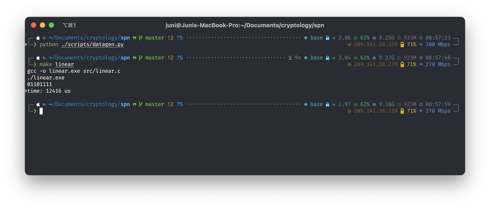

# 密码学实验报告

SPN 网络的实现以及线性密码分析。

## SPN

### 实现

SPN 的实现位于 `src/` 目录下，其中 `main.c` 用于 OJ 提交，`encryptor.c` 为一个命令行 SPN 加密器，用于线性分析中生成数据。

代码首先定义了实现的 SPN 算法的参数

```c
const size_t L = 4;
const size_t M = 4;
const size_t NR = 4;

/// Substitution parameters
const uint8_t PI_S[16] = {0xE, 0x4, 0xD, 0x1, 0x2, 0xF, 0xB, 0x8,
                          0x3, 0xA, 0x6, 0xC, 0x5, 0x9, 0x0, 0x7};

/// Permutation parameters
const uint8_t PI_P[16] = {0x0, 0x4, 0x8, 0xC, 0x1, 0x5, 0x9, 0xD,
                          0x2, 0x6, 0xA, 0xE, 0x3, 0x7, 0xB, 0xF};
```

然后定义了一个对一个 16 位整数进行分组的结构体。此处也可以使用位运算，但是为了清晰起见，使用了结构体和指针运算结合（这里暂时把）。

```c
/// Memory layout of a grouped `u`.
typedef struct {
  uint16_t a : 4;
  uint16_t b : 4;
  uint16_t c : 4;
  uint16_t d : 4;
} Group;
```

之后，利用这个结构体的内存布局实现 S 盒的计算

```c
/// Group-wise substitution
uint16_t substitute(uint16_t u) {
  uint16_t v = 0;
  Group* g = (Group*)(&u);
  Group* h = (Group*)(&v);

  h->a = PI_S[g->a];
  h->b = PI_S[g->b];
  h->c = PI_S[g->c];
  h->d = PI_S[g->d];

  return v;
}
```

以及密钥生成的函数，此处需要注意整数中比特的顺序与密钥定义中 $k_1, k_2,\cdots, k_{32}$ 的顺序相反，因此需要进行一次左移和右移。

```c
static uint32_t key = 0;

/// Generate a key for the `r`-th round
uint16_t generate_key(size_t r) {
  return (key << (4 * r - 4)) >> 16;
}
```

最后实现 P 盒，同样注意比特顺序在整数中的问题。

```c
/// Bitwise permutation
///
/// The highest bit in the number is the first bit in the array.
/// The `PI_P` should be applied in reverse order.
uint16_t permute(uint16_t v) {
  uint16_t w = 0;

  for (size_t i = 0; i < 16; i++) {
    uint16_t bit = (v & (0x8000 >> i)) != 0;
    w |= bit << (15 - PI_P[i]);
  }

  return w;
}
```

最后，实现完整的 SPN 加密算法。

```c
/// Encryption
uint16_t encrypt(uint16_t plaintext) {
  uint16_t w = plaintext;
  uint16_t u, v, key;

  for (size_t r = 1; r <= NR - 1; r++) {
    key = generate_key(r);
    u = w ^ key;
    v = substitute(u);
    w = permute(v);
  }

  key = generate_key(NR);
  u = w ^ key;
  v = substitute(u);

  key = generate_key(NR + 1);

  uint16_t ciphertext = v ^ key;

  return ciphertext;
}
```

以上就是 SPN 实现中的核心代码。

### 运行结果

使用 `main.c` 编译运行的结果如下：


OJ 提交评测结果如下


## 线性攻击算法

### 实现

线性攻击的实现包括 `scripts/datagen.py`，`src/encryptor.c` 和 `src/linear.c`。

`datagen.py` 首先根据密钥和数量生成数据用于线性分析，然后将数据写入 `data.txt` 中，具体实现可参见代码。

`linear.c` 中实现了线性攻击算法。首先定义 S 盒的逆参数

```c
/// Inverse substitution parameters
const uint8_t PI_S_INV[16] = {0xE, 0x3, 0x4, 0x8, 0x1, 0xC, 0xA, 0xF,
                              0x7, 0xD, 0x9, 0x6, 0xB, 0x2, 0x0, 0x5};

```

之后根据教材上的伪代码实现了线性攻击算法。在实现过程中仍然使用整数类型存储数据，同时与 SPN 的实现中一样需要注意整数中比特顺序的问题。此外，在遍历 $(L_1, L_2)$ 的时候直接从 `0x00` 到 `0xff`。

```c
/// Linear attack
uint8_t linear_attack(size_t size, uint16_t* plaintexts, uint16_t* ciphertexts) {
  size_t count[256];
  for (size_t i = 0; i <= 0xff; i++) {
    count[i] = 0;
  }

  for (size_t i = 0; i < size; i++) {
    uint16_t x = plaintexts[i];
    uint16_t y = ciphertexts[i];

    for (size_t candidate_key = 0; candidate_key <= 0xff; candidate_key++) {
      uint8_t l1 = (candidate_key & 0xf0) >> 4;
      uint8_t l2 = candidate_key & 0x0f;

      uint8_t y2 = (y & 0x0f00) >> 8;
      uint8_t y4 = y & 0x000f;

      uint8_t v2 = l1 ^ y2;
      uint8_t v4 = l2 ^ y4;

      uint8_t u2 = PI_S_INV[v2];
      uint8_t u4 = PI_S_INV[v4];

      uint8_t x_5_bit = (x & 0x0800) >> 11;
      uint8_t x_7_bit = (x & 0x0200) >> 9;
      uint8_t x_8_bit = (x & 0x0100) >> 8;
      uint8_t u_6_bit = (u2 & 0x04) >> 2;
      uint8_t u_8_bit = u2 & 0x01;
      uint8_t u_14_bit = (u4 & 0x04) >> 2;
      uint8_t u_16_bit = u4 & 0x01;

      uint8_t z =
        x_5_bit ^ x_7_bit ^ x_8_bit ^ u_6_bit ^ u_8_bit ^ u_14_bit ^ u_16_bit;

      if (z == 0) {
        count[candidate_key]++;
      }
    }
  }

  uint8_t maxkey = 0;

  for (size_t i = 0; i <= 0xff; i++) {
    count[i] = (size_t)abs((int)count[i] - (int)size / 2);
    if (count[i] > count[maxkey]) {
      maxkey = i;
    }
  }

  return maxkey;
}
```

此外，为了确定运行的速度，在主函数中对线性攻击的过程进行了计时

```c
struct timeval st, ed;
gettimeofday(&st, NULL);
uint8_t key = linear_attack(size, plaintexts, ciphertexts);
gettimeofday(&ed, NULL);
```

### 运行结果

首先使用密钥 `00111010100101001101011000111111` 生成 8000 条数据并且保存。

```c
data = datagen(0b00111010100101001101011000111111, 8000)
```

之后使用 `linear` 进行线性密码分析，其中第五轮的密钥应当是 `1101011000111111` 期望得到 $L_1=0110, L_2=1111$



最终得到正确结果，用时 12416 微秒。
